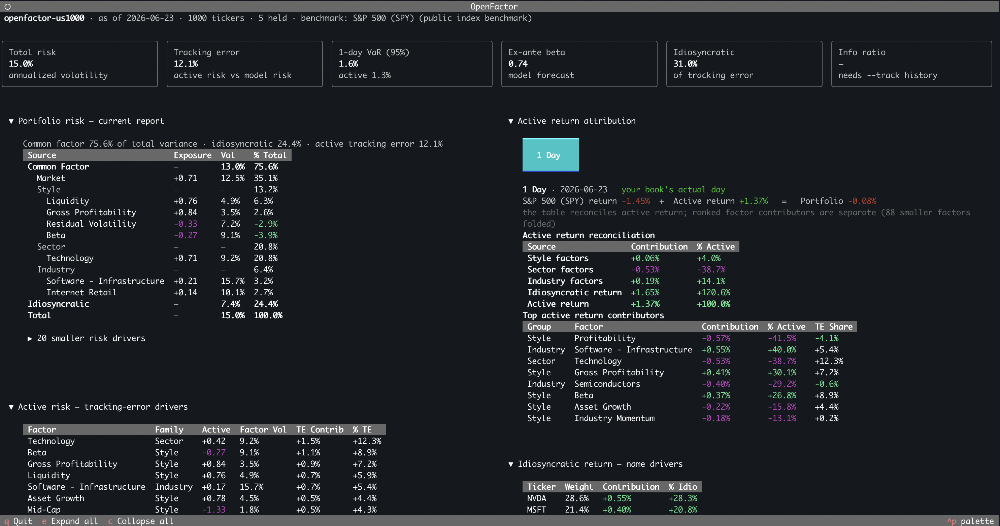

<div align="center">

# [OpenFactor](https://rallies.ai)

**Open-source equity factor risk model**

*Portfolio exposures, factor risk attribution, and idiosyncratic risk*

[](https://www.python.org/downloads/)
[](LICENSE)
[](https://github.com/faizann24)

</div>

<p align="center">
  
</p>

OpenFactor is a deterministic equity risk model for portfolio analytics, risk
attribution, and manager research workflows. It is designed to be an open
alternative to institutional multi-factor risk models.

## Public Model

The first public model is:

```text
openfactor-us1000
```

It covers the top 1000 active US common stocks by market cap.

## What the Model Provides

The model package loads:

| Object | Use |
| --- | --- |
| `universe` | Model constituents |
| `exposures` | Ticker-level factor exposures |
| `factor_returns` | Recent realized factor returns |
| `residual_returns` | Recent per-stock residual returns after common factors |
| `exposures_panel` | Lagged exposure rows for 1-day return attribution (loaded on demand) |
| `factor_covariance` | Annualized factor covariance matrix |
| `idiosyncratic_risk` | Annualized idiosyncratic residual risk |
| `metadata` | Universe name, model version, and model metadata |

These files are enough to report portfolio exposures, common-factor risk,
idiosyncratic risk, and total risk without direct access to vendor data.

## Python Usage

```bash
pip install git+https://github.com/ralliesai/openfactor.git
```

```python
import pandas as pd
import openfactor as of

portfolio = pd.DataFrame(
    {
        "ticker": ["AAPL", "MSFT", "NVDA"],
        "value": [400000, 300000, 300000],  # dollars held; negative for a short
    }
)

snapshot = of.load_snapshot("openfactor-us1000")
report = of.portfolio_report(portfolio, snapshot)
```

`portfolio_report` accepts a `value` column (dollar holdings, gross-normalized to
signed weights) or an `allocation` column of model weights — both produce the
same tables.

### Factor Model Data

OpenFactor also exposes aligned model data for downstream analytics:

```python
data = of.factor_model_data(snapshot)

data.tickers                    # asset index
data.exposures                  # assets x factors
data.factor_covariance          # factors x factors
data.idiosyncratic_variance     # asset idiosyncratic variance
data.benchmark_weights          # cap-weighted model risk proxy
data.factor_groups              # factor group labels

data.factor_exposure(weights)
data.active_factor_exposure(weights)
data.risk(weights)
data.tracking_error(weights)
data.beta(weights)
data.portfolio_frame(weights)
```

OpenFactor does not solve portfolios. It supplies exposures, covariance,
benchmark weights, idiosyncratic variance, and risk helpers that another library
can use.

## Factor Coverage

<table>
  <thead>
    <tr>
      <th>Family</th>
      <th>Factor</th>
      <th>Internal Name</th>
      <th>Construction</th>
    </tr>
  </thead>
  <tbody>
    <tr>
      <td rowspan="2"><strong>Market</strong></td>
      <td>Market</td>
      <td><code>market</code></td>
      <td>Benchmark market leg; SPY/S&amp;P 500 in the public default snapshot</td>
    </tr>
    <tr>
      <td>Beta</td>
      <td><code>beta</code></td>
      <td>Sensitivity to broad market returns</td>
    </tr>
    <tr>
      <td rowspan="2"><strong>Size</strong></td>
      <td>Size</td>
      <td><code>size</code></td>
      <td>Log market capitalization</td>
    </tr>
    <tr>
      <td>Mid-Cap</td>
      <td><code>mid_cap</code></td>
      <td>Nonlinear size exposure</td>
    </tr>
    <tr>
      <td rowspan="5"><strong>Momentum</strong></td>
      <td>Momentum</td>
      <td><code>momentum</code></td>
      <td>12-month return skipping the most recent month</td>
    </tr>
    <tr>
      <td>Industry Momentum</td>
      <td><code>industry_momentum</code></td>
      <td>Recent momentum of industry peers</td>
    </tr>
    <tr>
      <td>Seasonality</td>
      <td><code>seasonality</code></td>
      <td>Same-month historical return tendency</td>
    </tr>
    <tr>
      <td>Long-Term Reversal</td>
      <td><code>long_term_reversal</code></td>
      <td>Negative return from the prior long-horizon window</td>
    </tr>
    <tr>
      <td>Short-Term Reversal</td>
      <td><code>short_term_reversal</code></td>
      <td>Negative recent one-month return</td>
    </tr>
    <tr>
      <td rowspan="3"><strong>Volatility</strong></td>
      <td>Residual Volatility</td>
      <td><code>residual_volatility</code></td>
      <td>Volatility after removing market beta</td>
    </tr>
    <tr>
      <td>Downside Risk</td>
      <td><code>downside_risk</code></td>
      <td>Volatility of negative daily returns</td>
    </tr>
    <tr>
      <td>Prospect</td>
      <td><code>prospect</code></td>
      <td>Upside skew and drawdown profile</td>
    </tr>
    <tr>
      <td rowspan="2"><strong>Liquidity and Positioning</strong></td>
      <td>Liquidity</td>
      <td><code>liquidity</code></td>
      <td>Log average dollar volume</td>
    </tr>
    <tr>
      <td>Short Interest</td>
      <td><code>short_interest</code></td>
      <td>Short interest scaled by shares</td>
    </tr>
    <tr>
      <td rowspan="4"><strong>Value and Yield</strong></td>
      <td>Value</td>
      <td><code>value</code></td>
      <td>Book equity divided by market value</td>
    </tr>
    <tr>
      <td>Earnings Yield</td>
      <td><code>earnings_yield</code></td>
      <td>Net income divided by market value</td>
    </tr>
    <tr>
      <td>Forward Earnings Yield</td>
      <td><code>forward_earnings_yield</code></td>
      <td>Forward net-income estimate divided by market value</td>
    </tr>
    <tr>
      <td>Dividend Yield</td>
      <td><code>dividend_yield</code></td>
      <td>Trailing dividends divided by price</td>
    </tr>
    <tr>
      <td rowspan="2"><strong>Growth</strong></td>
      <td>Growth</td>
      <td><code>growth</code></td>
      <td>Revenue and earnings growth</td>
    </tr>
    <tr>
      <td>Forward Growth</td>
      <td><code>forward_growth</code></td>
      <td>Forward revenue and earnings growth</td>
    </tr>
    <tr>
      <td rowspan="5"><strong>Quality</strong></td>
      <td>Profitability</td>
      <td><code>profitability</code></td>
      <td>Net income divided by assets</td>
    </tr>
    <tr>
      <td>Gross Profitability</td>
      <td><code>gross_profitability</code></td>
      <td>Gross profit divided by assets</td>
    </tr>
    <tr>
      <td>Earnings Quality</td>
      <td><code>earnings_quality</code></td>
      <td>Cash-flow quality of earnings</td>
    </tr>
    <tr>
      <td>Earnings Variability</td>
      <td><code>earnings_variability</code></td>
      <td>Variability of recent quarterly earnings</td>
    </tr>
    <tr>
      <td>Capital Discipline</td>
      <td><code>investment_quality</code></td>
      <td>Low asset growth, low capex intensity, buybacks, and low issuance</td>
    </tr>
    <tr>
      <td rowspan="2"><strong>Balance Sheet</strong></td>
      <td>Leverage</td>
      <td><code>leverage</code></td>
      <td>Liabilities divided by assets</td>
    </tr>
    <tr>
      <td>Asset Growth</td>
      <td><code>investment</code></td>
      <td>Asset growth from latest filing data</td>
    </tr>
    <tr>
      <td rowspan="2"><strong>Classification</strong></td>
      <td>Sector</td>
      <td><code>sector:*</code></td>
      <td>Sector membership</td>
    </tr>
    <tr>
      <td>Industry</td>
      <td><code>industry:*</code></td>
      <td>Industry membership</td>
    </tr>
    <tr>
      <td><strong>Analyst</strong></td>
      <td>Analyst Sentiment</td>
      <td><code>sentiment</code></td>
      <td>Time-decayed analyst recommendation score</td>
    </tr>
  </tbody>
</table>

`market` is estimated inside the factor-return model. The remaining scalar,
sector, and industry factors are ticker-level exposures.

## CLI Usage

```bash
openfactor --universe openfactor-us1000 --portfolio portfolio.csv
```

`portfolio.csv` lists the **dollar value** held in each name (negative for a
short):

```csv
ticker,value
AAPL,400000
MSFT,300000
NVDA,300000
```

OpenFactor normalizes by gross exposure into signed weights, so the absolute
book size does not change percentage risk. The Python `portfolio_report` API
takes the same dollar `value` column (or an `allocation` weights column) directly.

The CLI opens an interactive [Textual](https://textual.textualize.io) terminal
that uses SPY as the default return benchmark when public index files are
present, keeps ex-ante tracking error in model-risk space, and leads with the
decision numbers:

- **Headline cards** — total risk, tracking error, one-day VaR (95%), ex-ante
  beta to the model risk proxy, and the idiosyncratic share of tracking
  error.
- **Portfolio risk** — the current absolute risk decomposition: common factor,
  market, style, sector, industry, idiosyncratic, and total risk.
- **Active risk** — every factor's active exposure and its **% of the
  tracking-error budget**, sorted, with annualized contribution-to-tracking-error
  shown next to the share. Diversifying factors (those that *reduce* tracking
  error through covariance) are shown in green.
- **Idiosyncratic risk by name** — which holdings drive idiosyncratic risk,
  with top-name concentration and the effective number of names.
- **Active return attribution** — benchmark return + active return = portfolio
  return for the latest trading day. The panel has two separate tables:
  **Active return reconciliation** for style, sector, industry, idiosyncratic
  return, and total active return; and **Top active return contributors** for
  ranked factor details with contribution, `% Active`, and `TE Share` side by
  side. When enough `--track` history exists, the same panel adds multi-day
  attribution buttons for the stored holding path.
- **Idiosyncratic return by name** — the holdings that drove the name-level
  return line, adjusted so the name rows reconcile to the benchmark-relative
  idiosyncratic return shown in the active-return table.
- **Parametric loss & beta** — normal one-day VaR (95% / 99%, total and active),
  ex-ante beta, realized beta when a `--track` history exists, and realized
  information ratio. Historical and macro scenarios are omitted until the
  snapshot ships a real scenario library.

### Building a track record

A single run shows where you stand *today*. To turn daily snapshots into a real
track record, pass `--track <folder>`:

```bash
openfactor --portfolio portfolio.csv --track ./openfactor-track
```

The track folder is local to your machine. It does not write to OpenFactor's
public buckets. Each run stores one dated report under `days/<date>/` and
rebuilds aggregate CSVs at the folder root for analysis. Re-running the same
snapshot date overwrites that date's files.

The folder stores enough detail to answer real multi-day questions later:

| File | Contents |
| --- | --- |
| `track.csv` | Daily portfolio, benchmark, active return, risk, beta, and summary fields |
| `holdings.csv` | Daily portfolio weights |
| `factor_contrib.csv` | Daily factor return contributions |
| `idiosyncratic_returns.csv` | Daily idiosyncratic return by holding |
| `idiosyncratic_risk.csv` | Daily idiosyncratic risk by holding |
| `active_risk.csv` | Daily active-risk driver rows |
| `risk_rows.csv` | Daily total-risk decomposition rows |
| `days/<date>/report.json` | Complete report snapshot for that date |

Run it daily and the stored daily returns accumulate into realized beta,
information ratio, hit rate, and cumulative active return. To backfill honestly,
run past dates (`--snapshot <date>`) with the holdings you *actually* held then,
not today's weights.

Because each day's factor and idiosyncratic return breakdown is stored, the
Active return attribution panel adds multi-day buttons as history builds:

| Stored days | Button |
| --- | --- |
| 7+ | `1W` |
| 22+ | `1M` |
| 63+ | `1Q` |
| 252+ | `1Y` |
| More than 252 | `All` |

Each button sums the real stored daily holdings over that window. It is not a
backtest and it does not run today's weights backward. The idiosyncratic return
name-driver table switches with the selected window too, using average weight
over the selected stored days.

### Semantic residual discovery

Pass `--semantic` to run LLM semantic residual discovery *before* the terminal
opens; any accepted factors then appear in a **Semantic residual discovery**
panel in the report:

```bash
export OPENAI_API_KEY=sk-...
openfactor --portfolio portfolio.csv --semantic
```

It needs `OPENAI_API_KEY` (LLM + web search). Without the key, OpenFactor asks
whether to continue with the normal report or exit, rather than running
discovery. See [Semantic Residual Discovery](#semantic-residual-discovery) below
for what it finds and the equivalent Python API.

The terminal lives in [`tui/`](src/openfactor/tui/); the underlying analytics are
in [`portfolio/active_risk.py`](src/openfactor/portfolio/active_risk.py). By
default OpenFactor loads the latest published model — pass `--snapshot <date>`
for a reproducible historical run.

## Report Output

`portfolio_report()` returns a dictionary of pandas tables.

| Key | Table |
| --- | --- |
| `missing_holdings` | Holdings not found in the model universe |
| `style` | Portfolio exposure to scalar factors |
| `sector` | Portfolio sector allocation |
| `idiosyncratic_risk` | Holding-level idiosyncratic risk |
| `factor_risk` | Factor exposure, factor volatility, risk contribution, and variance contribution |
| `active_risk` | Benchmark-relative factor exposure and tracking-error contribution |
| `risk_share` | Factor vs idiosyncratic variance share |
| `total_risk` | Factor, idiosyncratic, and total annualized risk |
| `tracking_error` | Active factor, idiosyncratic, and total tracking error vs the benchmark |

Example report access:

```python
report["style"]
report["factor_risk"]
report["active_risk"]
report["total_risk"]
report["tracking_error"]
```

Typical table shapes:

```text
style
                      exposure
Beta                    ...
Momentum                ...
Size                    ...
Value                   ...

factor_risk
                      exposure  factor_volatility  risk_contribution
Beta                       ...                ...                ...
Sector: Technology         ...                ...                ...
Momentum                   ...                ...                ...

total_risk
                    risk
factor               ...
idiosyncratic        ...
total                ...
```

## Semantic Residual Discovery

Semantic discovery is on-demand. The base model stays deterministic; the LLM is
only called when a portfolio still has enough unexplained idiosyncratic risk to
justify looking for a missing common risk.

The bundled client uses web search. Normal OpenFactor reports do not construct
the LLM client or require `OPENAI_API_KEY`.

```bash
pip install git+https://github.com/ralliesai/openfactor.git
```

```python
result = of.discover_semantic_factors(
    portfolio,
    snapshot,
    threshold=0.10,  # 10% residual variance share; pass 0.20 for 20%
    semantic_cache="r2://openfactor-public/semantic_factors.csv",
)

result.candidates
result.accepted
result.skipped
```

Semantic discovery is primarily a Python API (`discover_semantic_factors()`,
above). The terminal also runs it on demand: `openfactor --portfolio
portfolio.csv --semantic` (needs `OPENAI_API_KEY`) runs discovery first and adds
a **Semantic residual discovery** panel to the report.

Environment:

User runtime:

| Variable | Required For |
| --- | --- |
| `OPENAI_API_KEY` | LLM discovery and membership classification |
| `OPENFACTOR_SEMANTIC_MODEL` | Optional model override |
| `OPENFACTOR_SEMANTIC_TIMEOUT` | Optional per-request timeout override |

Maintainer publishing only:

| Variable | Required For |
| --- | --- |
| `OPENFACTOR_R2_ACCOUNT_ID` | Writing shared public artifacts |
| `OPENFACTOR_R2_ACCESS_KEY_ID` | Writing shared public artifacts |
| `OPENFACTOR_R2_SECRET_ACCESS_KEY` | Writing shared public artifacts |

Normal users do not need R2 credentials. The default shared semantic cache is
read through the public URL. If discovery finds new labels on a machine without
R2 write credentials, the result is still returned; OpenFactor just skips the
shared cache write-back.

How it works:

| Step | Behavior |
| --- | --- |
| Trigger | Runs only when `discover_semantic_factors()` is called |
| Residual window | Uses recent residual-return history, default `63` trading days |
| Discovery | Uses residual PCA, deterministic exposures, and web search to propose missing common risks |
| Guardrail | Rejects candidates already explained by market, sector, industry, or existing style factors |
| Membership | Classifies each universe stock as binary `0/1`, not a fragile LLM score |
| Refit | Keeps candidates when idiosyncratic return variance is lower after adding them |
| Cache | Reuses old binary labels and only asks the LLM for missing ticker/factor cells; write-back is optional |

The shared semantic cache lives in the Cloudflare public bucket:

[semantic_factors.csv](https://openfactor-data.rallies.ai/semantic_factors.csv)

Shape:

```csv
ticker,ai_infrastructure,retail_flow
NVDA,1,0
GME,0,1
AAPL,0,0
```

Load members for one semantic factor:

```python
import openfactor as of

stocks = of.semantic_factor_members("Retail Speculation")
# ["GME", "HOOD", "RDDT", ...]
```

The function accepts either the readable factor name or the cache column id:

```python
stocks = of.semantic_factor_members("retail_speculation")
```

If yesterday's cache covered 1000 stocks and today's universe has 1001, the
existing 1000 labels are reused and only the new ticker is classified. Rows for
tickers that leave the universe can stay in the cache; they are harmless and
useful if the ticker re-enters later.

Institutions can also pass their own client with a
`complete_json(instructions, payload)` method. Pass a local `semantic_cache`
path for private experiments if they want write-back without OpenFactor
maintainer credentials; the default shared cache is a public read-only object
for normal users.

## Model Methodology

OpenFactor separates **exposures** (how much each stock loads on a factor) from
**factor returns** (what each factor earned), and estimates both with no
look-ahead.

### Exposures

Exposures are built from price history, market data, point-in-time fundamentals,
forward estimates, analyst data, and sector/industry classification. Each scalar
exposure is winsorized around the cross-sectional median (MAD-based, so a handful
of outliers can't dominate) and then standardized to a z-score. The cap-weighted
mean is removed so the market sits near zero on every style factor (each exposure
reads as a tilt relative to the market), and the score is divided by the
equal-weighted standard deviation so a few mega-caps don't set the scale. It falls
back to equal weighting when caps are missing. Sector and industry exposures stay
categorical.

Exposures for a given day use only information known *before* that day's return:
prices through the prior close, and the fundamentals and estimates effective as
of that date. Nothing from the future leaks in.

### Factor returns

Each day, factor returns come from a single Barra-style cross-sectional
regression of stock returns on exposures:

```text
stock return = S&P 500 benchmark market + sector + industry + style factors + residual
```

The fit is built to be robust:

- **Root-cap weighted (WLS)** — regression weights are √(market cap), so large,
  liquid names anchor the fit without a handful of mega-caps dominating it.
- **Sector returns constrained to a cap-weighted sum of zero**, so sector
  returns read as clean tilts relative to the benchmark market leg.
- **Winsorized stock returns** — a single name's blow-up day can't distort the
  estimates.
- **Explicit market, sector, broad-industry, and style factors**, with
  thinly-populated industries folded out of the cross-section.
- **Rolling and point-in-time** — re-run each day on that day's as-of exposures,
  producing a clean daily history of factor returns and per-stock residuals.

The residuals are what remains after every common factor, and they drive
idiosyncratic risk.

### Risk

Factor covariance is the annualized sample covariance of recent daily factor
returns. Idiosyncratic risk is each stock's annualized residual volatility,
treated as uncorrelated across names.

Risk attribution then combines portfolio factor exposures with the factor
covariance matrix for common-factor risk, and adds idiosyncratic risk at the
portfolio level to give factor, idiosyncratic, and total risk.

### Benchmark and active risk

The report carries public index and ETF benchmark files outside the stock factor
universe: broad-market and size proxies (SPY, QQQ, IWM, IJH, IJR), the eleven
sector SPDRs, and a set of style/factor ETFs (momentum, value, quality,
volatility, dividend, and growth). Return attribution uses **S&P 500 via SPY** as
the default benchmark return when `index_returns.csv` is present, so the headline
is SPY benchmark return plus active return equals portfolio return.

`openfactor-us1000` is the stock universe and public dataset namespace. It is not
used as the return benchmark. When SPY returns are available, the model pins the
`market` factor to SPY and estimates the remaining style, sector, industry, and
idiosyncratic returns around that benchmark leg.

The ex-ante risk model still needs a holdings-style risk proxy. Until
OpenFactor publishes index look-through or index factor exposures, tracking error
and model beta use the **cap-weighted model universe** — every model constituent
weighted by market cap — because that risk proxy ships with the model and
needs no index license.

Active exposures are the portfolio's exposures minus the risk proxy's
(`active = portfolio − risk proxy`), and the same factor covariance and
idiosyncratic risk produce active factor risk, active idiosyncratic risk, and total
**tracking error**. Because style exposures are standardized around the
cap-weighted mean, the risk proxy sits near zero on every style factor: active
style exposures read
as the portfolio's tilts, the market factor nets to zero, and sector and industry
carry the real risk-proxy-relative bets.

Return attribution uses lagged exposures times realized factor returns, plus
idiosyncratic returns. The active-return table reconciles active return versus
SPY with style, sector, industry, idiosyncratic, and total active rows; it does
not show a separate universe-return leg. `% Active` is contribution divided by
active return, so it can exceed 100% when positive and negative drivers offset.
`TE Share` is the same factor's contribution to tracking error from the ex-ante
risk model.

## Model Quality

Evidence that the model explains returns, measured on the published
`openfactor-us1000` model. These are in-sample, explanatory statistics: they
describe how well the factors fit realized returns, not a forward risk-forecast
calibration (bias statistics are future work).

### Cross-sectional fit

| Statistic | Value |
| --- | ---: |
| Daily cross-sectional R², mean | 63.57% |
| Daily cross-sectional R², median | 63.35% |
| Trading days in window | 252 |
| Average stocks per regression | 861 |

On an average day the model explains roughly **64% of the cross-sectional
dispersion of stock returns** across market, sector, industry, and style factors.
The R² is weighted consistently with the WLS fit and measured around
the cap-weighted mean return, so it reflects dispersion explained *relative to the
market* and is not inflated by large index moves. It is a raw, in-sample fit over
the latest 252 trading days (~1 year, a single market regime), and the
near-identical mean and median indicate a stable day-to-day distribution. The
roughly 861 of 1000 names per day reflect stocks dropped when required inputs are
missing or their industry group is too thin to estimate.

### Factor sanity check

OpenFactor's momentum factor return tracks recognized public momentum factors:

| Benchmark | Correlation | Sample |
| --- | ---: | --- |
| Ken French U.S. Mom | 0.77 | daily, ~1 year overlap |
| AQR VME U.S. Momentum | 0.59 | monthly, ~12 observations |

The daily correlation with Ken French is the stronger signal; the monthly AQR
figure rests on only ~12 points and should be read as directional. OpenFactor's
factor is *purified* — a cross-sectional regression return, orthogonal to the
model's other factors (size, beta, sector, and the rest) — while the benchmarks
are raw sorted portfolios, so a correlation in this range is what we expect and
confirms the factor captures momentum rather than replicating any single index.

## Roadmap

OpenFactor ships a clean, transparent baseline today. Planned enhancements to the
covariance and idiosyncratic-risk estimation include:

- **Eigenfactor covariance adjustment** — debias the factor covariance for use in
  optimized portfolios.
- **Volatility-regime scaling** — align forecast risk with the current market
  volatility level.
- **Newey-West adjustment** — account for serial correlation in daily factor
  returns.
- **EWMA / half-life weighting** — give recent observations more weight.
- **Bayesian shrinkage of idiosyncratic risk** — stabilize idiosyncratic estimates
  using observation counts.
- **Bias-statistic calibration** — measure the model's forecast accuracy over
  time.

## Files

The public model is stored as inspectable CSV and JSON files:

```text
exposures.csv
details/exposures_long.csv
details/exposures_panel.csv.gz
factor_returns.csv
residual_returns.csv
factor_covariance.csv
idiosyncratic_risk.csv
universe.csv
indexes.csv
index_prices.csv
index_returns.csv
metadata.json
```

Current public files:

| File | URL |
| --- | --- |
| Latest pointer | [latest.json](https://openfactor-data.rallies.ai/factors/openfactor-us1000/latest.json) |
| Metadata | [metadata.json](https://openfactor-data.rallies.ai/factors/openfactor-us1000/latest/metadata.json) |
| Exposures | [exposures.csv](https://openfactor-data.rallies.ai/factors/openfactor-us1000/latest/exposures.csv) |
| Long exposures | [details/exposures_long.csv](https://openfactor-data.rallies.ai/factors/openfactor-us1000/latest/details/exposures_long.csv) |
| Exposure panel (gzip) | [details/exposures_panel.csv.gz](https://openfactor-data.rallies.ai/factors/openfactor-us1000/latest/details/exposures_panel.csv.gz) |
| Factor returns | [factor_returns.csv](https://openfactor-data.rallies.ai/factors/openfactor-us1000/latest/factor_returns.csv) |
| Residual returns | [residual_returns.csv](https://openfactor-data.rallies.ai/factors/openfactor-us1000/latest/residual_returns.csv) |
| Factor covariance | [factor_covariance.csv](https://openfactor-data.rallies.ai/factors/openfactor-us1000/latest/factor_covariance.csv) |
| Idiosyncratic risk | [idiosyncratic_risk.csv](https://openfactor-data.rallies.ai/factors/openfactor-us1000/latest/idiosyncratic_risk.csv) |
| Universe | [universe.csv](https://openfactor-data.rallies.ai/factors/openfactor-us1000/latest/universe.csv) |
| Index metadata | [indexes.csv](https://openfactor-data.rallies.ai/factors/openfactor-us1000/latest/indexes.csv) |
| Index prices | [index_prices.csv](https://openfactor-data.rallies.ai/factors/openfactor-us1000/latest/index_prices.csv) |
| Index returns | [index_returns.csv](https://openfactor-data.rallies.ai/factors/openfactor-us1000/latest/index_returns.csv) |
| Semantic cache | [semantic_factors.csv](https://openfactor-data.rallies.ai/semantic_factors.csv) |

The runtime loader reads the public model files and returns:

```python
snapshot.universe
snapshot.exposures
snapshot.factor_returns
snapshot.residual_returns
snapshot.factor_covariance
snapshot.idiosyncratic_risk
snapshot.indexes
snapshot.index_prices
snapshot.index_returns
snapshot.metadata
```

## Scope

OpenFactor is the risk model layer.

It does not optimize portfolios, run strategy backtests, or simulate execution
costs. Those workflows should consume OpenFactor as the risk-model layer from
separate portfolio construction or backtesting packages.

---

<div align="center">
Built with ❤️ by <a href="https://rallies.ai">Rallies.ai</a>
</div>
